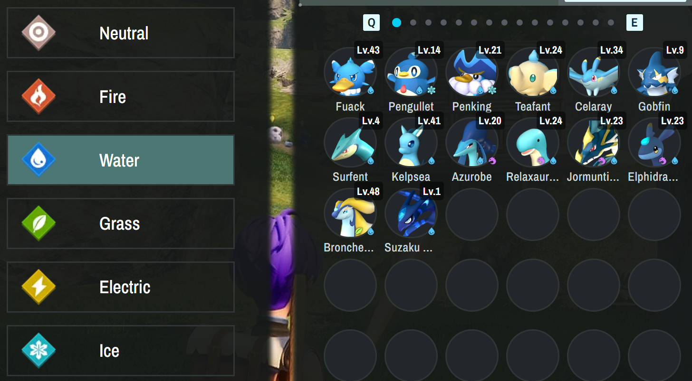

# Palbox UI improvements demo

Created by Oliver Levay because I love Palworld ❤️

This is prototype I created to showcase how I wish that the palbox UI works.

Not much for reading? Check out the DEMO here:

https://palbox.netlify.app/ (DESKTOP ONLY)

I recommend zooming out on smaller screens.

Feedback is very welcome!

## Goal

When I'm playing palworld I'm having a blast, but searching through my palbox to find the pal I want is a pain. The goal with this project was to create a system that makes it as easy and intuitive as possible to find the pals I'm looking for. Unfortunately I don't know anything about modding otherwise this would be a great candidate for a mod. I'm hoping that pocketpair will implement some of these features into the AWESOME game called Palworld.

## Features

### Clarity

The pal "circles" have been updated to display their names, levels and elements so that you can easier identify your favorite pals.

### Search bar

There is a search bar so that you can always find exactly the pal you are looking for.

### Element filter

You can filter by element, so that even if you don't remember the name of your favorite pal you can still find them.

If you enter two different elements into the filter, it shows pals that have both elements.

### Level filter

There is a level filter so that you can find your strongest (or weakest) pals easily.

### Work suitability filter

Having trouble finding the best plas to work in your base? Look no further, with the Work Suitability filter finding your strongest kindling pal is a breeze. 

The filters also apply to your base and can be used to upgrade from kindling 1->kindling 2 pals for example.

## Future

### Passive skills filter

Right now there's an empty tab with "passive skills". The idea here is to have a list of passive skills, like "ferocious" or "burly body". I just haven't had time to put them all in there yet. It would also be nice with a checkbox like "display positive passives only" and "hide elemental bonuses" to really find the passives that you want. This filter needs a bit more finesse, since players might want to find a pal that ONLY has "ferocious" and nothing else, or they might want to find a pal that has "ferocious" and some others and it doesn't have to be the only one. 

### Import save file

I'm looking into players being able to import their save file into this project and display their pals, but it seems like a difficult task. All the pals in boxes are put into the "Level.sav" file, and unpacking that file to a readable format makes it HUGE, like 500MB huge. If someone has a solution to this please let me know or make a pull request to this repository.

If I get enough funds and Pocketpair do not implement this themselves, I will try to put up a bounty for creating a mod that has this functionality. The issue with creating mods this early is that changes come rapidly and if you create a mod it might not last that long.

## Choices

### Party Screen

Of course I think that the original party screen looks cooler, but it takes up too much space that can be used for filtering. So I made it smaller and added it on top.

Before

After

It doesn't look as cool but no important information is lost in my opinion.

### Filter everywhere

It's very intentional that the filters apply to your Party, Box and Base. The reason being that the pal you are looking for might be hiding in your base or party. 

If you have any feedback, reach out to me on Twitter, Reddit or by making an issue to the GitHub repository.